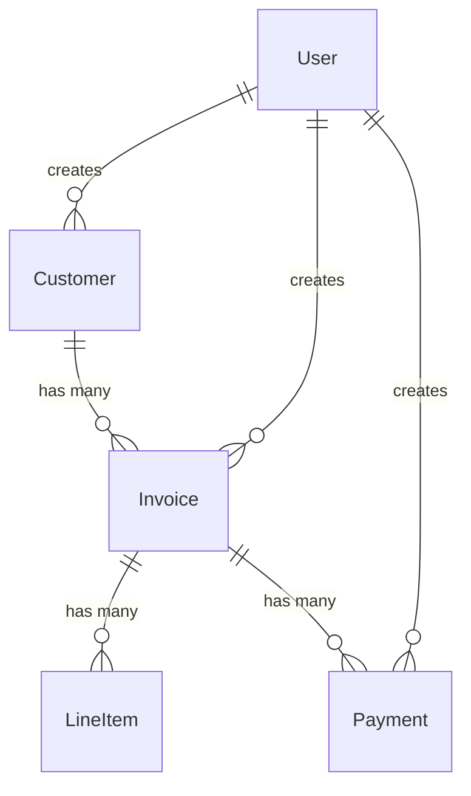

# InvoiceMe - Development Plan

All entities extend from **BaseEntity** which provides audit trails, soft delete, and optimistic locking.

**Note:** All timestamps stored in UTC (GMT+0), converted to user timezone only in UI.

---

## BaseEntity (Abstract)

### Read-Only Fields

| Field | Type | Description |
|-------|------|-------------|
| `id` | UUID | Primary identifier |
| `createdAt` | Instant | UTC timestamp of creation |
| `createdBy` | UUID | User ID who created |
| `lastModifiedAt` | Instant | UTC timestamp of last modification |
| `lastModifiedBy` | UUID | User ID who last modified |
| `version` | Long | Optimistic locking version |
| `isDeleted` | Boolean | Soft delete flag |
| `deletedAt` | Instant | UTC timestamp of deletion |
| `deletedBy` | UUID | User ID who deleted |

**Soft Deletes:** When an entity is deleted, it is not physically removed from the database. Instead, `isDeleted` is set to `true`, and `deletedAt`/`deletedBy` are populated. Deleted records are excluded from all queries and operations (enforced at the data access layer). This preserves historical data and audit trails while preventing deleted entities from appearing in application logic.

---

## User

### Fields

| Field | Type | Description |
|-------|------|-------------|
| `email` | String | User email address |
| `passwordHash` | String | Hashed password |
| `firstName` | String | User first name |
| `lastName` | String | User last name |

**Validation:**
- `email` - required, unique, valid email format
- `password` - required, minimum 8 characters (hashed before storing)

---

## Customer

### Fields

| Field | Type | Description |
|-------|------|-------------|
| `companyName` | String | Customer/company name |
| `contactFirstName` | String | Contact person first name |
| `contactLastName` | String | Contact person last name |
| `email` | String | Customer email address |
| `phone` | String | Contact phone number |
| `addressLine1` | String | Street address line 1 |
| `addressLine2` | String | Street address line 2 |
| `city` | String | City |
| `state` | String | State/Province |
| `zipCode` | String | Postal/ZIP code |
| `country` | String | Country |

### Read-Only Fields

| Field | Type | Description |
|-------|------|-------------|
| `draftInvoiceCount` | Integer | Count of invoices with status DRAFT |
| `sentInvoiceCount` | Integer | Count of invoices with status SENT |
| `paidInvoiceCount` | Integer | Count of invoices with status PAID |
| `totalOutstanding` | BigDecimal | Sum of balances for invoices with status SENT |

**Database Indexes:**
- `email WHERE isDeleted = false` - unique partial index for lookups and uniqueness constraint

### Operations

#### GetCustomerById (Read)
**Input:** Customer ID

**Returned Fields:**
- All Customer Fields and Read-Only Fields
- All BaseEntity Read-Only Fields

#### ListAllCustomers (Read)
**Input:** Optional filter by any customer field(s), optional pagination parameters

**Returned Fields:**
- `companyName`
- `email`
- `totalOutstanding`
- Sorted by company name (default)

#### CreateCustomer (Write)
**Validation:**
- `companyName` - required, not blank
- `email` - required, unique across customers, valid email format
- All other fields optional

**Data Updates:**
- Create new Customer entity

#### UpdateCustomer (Write)
**Validation:**
- `customerId` - must exist and not deleted
- Same rules as CreateCustomer

**Data Updates:**
- Update Customer entity fields
- Update `customerName` on all related Invoices to match new `companyName`

#### DeleteCustomer (Write)
**Validation:**
- Customer must exist and not already deleted
- Cannot delete if customer has any invoices with status SENT

**Data Updates:**
- Delete Customer
- Cascade delete to all related Invoices

---

## Invoice

### Fields

| Field | Type | Description |
|-------|------|-------------|
| `customerId` | UUID | Foreign key to Customer |
| `invoiceNumber` | String | Unique invoice number |
| `notes` | String | Invoice notes/terms |

### Read-Only Fields

| Field | Type | Description |
|-------|------|-------------|
| `invoiceDate` | Instant | UTC timestamp when invoice sent |
| `status` | Enum | Invoice status (DRAFT, SENT, PAID) |
| `customerName` | String | Customer company name (denormalized from Customer) |
| `total` | BigDecimal | Total invoice amount (sum of non-deleted LineItem.lineTotal) |
| `amountPaid` | BigDecimal | Total amount paid (sum of Payment.amount) |

**Database Indexes:**
- `invoiceNumber WHERE isDeleted = false` - unique partial index for uniqueness constraint
- `status WHERE isDeleted = false` - for filtering by invoice status (partial index)
- `customerId WHERE isDeleted = false` - for filtering by customer (partial index)
- `invoiceDate WHERE isDeleted = false` - for sorting and date range queries (partial index)

### Operations

#### GetInvoiceById (Read)
**Input:** Invoice ID

**Returned Fields:**
- All Invoice Fields and Read-Only Fields
- All BaseEntity Read-Only Fields
- **Calculated:** `balance` = total - amountPaid

#### ListInvoices (Read)
**Input:** Optional filter by any invoice field(s) (including `status`, `customerId`), optional pagination parameters

**Returned Fields:**
- `invoiceNumber`
- `status`
- `customerName`
- `total`
- `amountPaid`
- **Calculated:** `balance` = total - amountPaid
- Sorted by invoice date (descending, default)

#### CreateInvoice (Write)
**Validation:**
- `customerId` - required, must reference existing customer
- `invoiceNumber` - optional, if not provided will auto-generate unique number
- `notes` - optional

**Data Updates:**
- Create new Invoice entity
- Generate unique `invoiceNumber` if not provided (format: INV-{YYYY}-{sequential 5-digit number}, e.g., INV-2025-00001)
- Set `customerName` from Customer.companyName
- Set `status` to DRAFT
- Set `total` to 0
- Set `amountPaid` to 0
- Increment Customer.draftInvoiceCount

#### UpdateInvoice (Write)
**Validation:**
- Invoice must exist and not deleted
- Invoice status must be DRAFT for user-initiated edits
- `invoiceNumber` - optional, must be unique if provided
- `notes` - optional

**Note:** After an Invoice is marked as SENT, it can still receive cascaded updates from the Customer record (e.g., `customerName` field changes), but user-initiated edits are not allowed, and the Invoice cannot be deleted until fully PAID.

**Data Updates:**
- Update Invoice fields (`invoiceNumber`, `notes`)
- If `customerName` changes (from cascaded Customer update), update `customerName` on all related LineItems and Payments

#### MarkInvoiceAsSent (Write)
**Validation:**
- Invoice must exist and not deleted
- Current status must be DRAFT
- `total` must be > 0

**Note:** Invoice status transitions are one-way only (DRAFT → SENT → PAID). Once an invoice is SENT, it cannot return to DRAFT.

**Data Updates:**
- Set `status` to SENT
- Set `invoiceDate` to current UTC timestamp
- Decrement Customer.draftInvoiceCount
- Increment Customer.sentInvoiceCount
- Add Invoice.total to Customer.totalOutstanding

#### DeleteInvoice (Write)
**Validation:**
- Invoice must exist and not already deleted
- Invoice status must be DRAFT or PAID (SENT invoices cannot be deleted)

**Data Updates:**
- Delete Invoice
- Cascade delete to all related LineItems
- Cascade delete to all related Payments
- If status is DRAFT: Decrement Customer.draftInvoiceCount
- If status is PAID: Decrement Customer.paidInvoiceCount

---

## LineItem

### Fields

| Field | Type | Description |
|-------|------|-------------|
| `invoiceId` | UUID | Foreign key to Invoice |
| `description` | String | Product/service description |
| `quantity` | BigDecimal | Quantity |
| `unitPrice` | BigDecimal | Price per unit |

### Read-Only Fields

| Field | Type | Description |
|-------|------|-------------|
| `customerName` | String | Customer company name (denormalized from Invoice) |
| `lineTotal` | BigDecimal | Line total amount (quantity × unitPrice) |

**Database Indexes:**
- `invoiceId WHERE isDeleted = false` - for filtering by invoice (partial index)

### Operations

#### GetLineItemById (Read)
**Input:** LineItem ID

**Returned Fields:**
- All LineItem Fields and Read-Only Fields
- All BaseEntity Read-Only Fields

#### ListLineItemsForInvoice (Read)
**Input:** Invoice ID

**Returned Fields:**
- All LineItem Fields and Read-Only Fields
- Sorted by creation date (ascending)

#### CreateLineItem (Write)
**Validation:**
- Invoice must exist and not deleted
- Invoice status must be DRAFT
- `description` - required, not blank
- `quantity` - required, > 0
- `unitPrice` - required, > 0

**Data Updates:**
- Create new LineItem entity
- Set LineItem.customerName from Invoice.customerName
- Calculate and set LineItem.lineTotal (quantity × unitPrice)
- Recalculate Invoice.total (sum of all non-deleted LineItem.lineTotal for the invoice)

#### UpdateLineItem (Write)
**Validation:**
- LineItem must exist and not deleted
- Invoice status must be DRAFT
- `description` - required, not blank
- `quantity` - required, > 0
- `unitPrice` - required, > 0

**Data Updates:**
- Update LineItem fields
- Recalculate and set LineItem.lineTotal (quantity × unitPrice)
- Recalculate Invoice.total (sum of all non-deleted LineItem.lineTotal for the invoice)

#### DeleteLineItem (Write)
**Validation:**
- LineItem must exist and not already deleted
- Invoice status must be DRAFT

**Data Updates:**
- Delete LineItem
- Recalculate Invoice.total (sum of all non-deleted LineItem.lineTotal)

---

## Payment

### Fields

| Field | Type | Description |
|-------|------|-------------|
| `invoiceId` | UUID | Foreign key to Invoice |
| `paymentDate` | Instant | UTC timestamp of payment |
| `amount` | BigDecimal | Payment amount |
| `paymentMethod` | Enum | Payment method (CASH, CHECK, CREDIT_CARD, BANK_TRANSFER, OTHER) |
| `referenceNumber` | String | Check number, transaction ID, etc. |
| `notes` | String | Payment notes |

### Read-Only Fields

| Field | Type | Description |
|-------|------|-------------|
| `customerName` | String | Customer company name (denormalized from Invoice) |

**Database Indexes:**
- `invoiceId WHERE isDeleted = false` - for filtering by invoice (partial index)

### Operations

#### GetPaymentById (Read)
**Input:** Payment ID

**Returned Fields:**
- All Payment Fields and Read-Only Fields
- All BaseEntity Read-Only Fields

#### ListPaymentsForInvoice (Read)
**Input:** Invoice ID

**Returned Fields:**
- All Payment entity fields
- Sorted by payment date (ascending)

#### RecordPayment (Write)
**Validation:**
- Invoice must exist and not deleted
- Invoice status must be SENT or PAID
- `amount` - required, > 0
- `paymentDate` - required, cannot be before invoice date
- `paymentMethod` - required

**Note:** Payments cannot be deleted by users. If a payment is reversed (e.g., bounced check), create a new invoice for the returned payment amount plus any applicable fees. Payments can only be deleted via cascade deletion when their parent Invoice is deleted.

**Limitation:** The system does not validate or prevent overpayments (amountPaid > total). If a payment causes the total amountPaid to exceed the invoice total, the invoice will still be marked as PAID.

**Data Updates:**
- Create Payment record
- Set Payment.customerName from Invoice.customerName
- Recalculate and update Invoice.amountPaid (sum of all Payment.amount for the invoice)
- If Invoice.amountPaid >= Invoice.total, update Invoice.status to PAID
- If Invoice status changes to PAID:
  - Decrement Customer.sentInvoiceCount
  - Increment Customer.paidInvoiceCount
  - Subtract Invoice.total from Customer.totalOutstanding

---

## Entity Relationships

